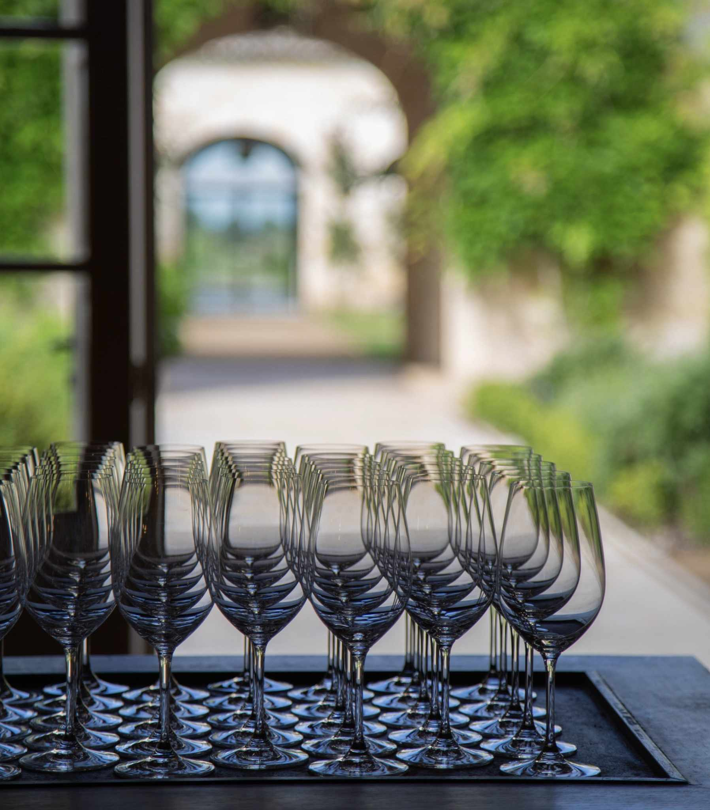

# Data Camp 2024

## Starting Kit - Wine competition

Authors :

**Solal Danan / sol-dnn**

**Gaspard Blaise / gaspardblaise**

**Lucas Aljancic / lucasaljc**

**Vincent Lagarde / vincent-lagarde**

**Gregoire Mourre / gregoiremrr**

**Marceau Leclerc / marssoo**

[](https://github.com/ramp-kits/template-kit/actions/workflows/test.yml)

## Introduction

Oenology, the science and study of wine, is a field that combines tradition, expertise, and sensory analysis. France is a global leader in wine production and represents a tenth of world production. Moreover, the wine industry represents nearly 450,000 jobs in France. Renowned for its historic terroirs, exceptional wines, and culinary artistry, France is also celebrated for its mastery of sommelier expertise.

<div style="display: flex; justify-content: center;">
    
</div>


Each year, wine enlightened enthusiasts and professional sommeliers compete in blind tasting competitions, where the goal is to identify key characteristics of a wine, such as its region, sub-region, grape variety, appellation, vintage, and even the estate. Participants rely on their extensive knowledge and sensory training to evaluate attributes like acidity, bitterness, tannins, color intensity, texture, and aromatic markers. For instance, a wine with pronounced lemon and hydrocarbon aromas, coupled with high acidity, is likely a Riesling from Alsace.

Inspired by this tradition, we present a Data Challenge that bridges the worlds of oenology and data science. The objective is to train a model capable of predicting the origin of a wine based on its characteristics. Using [Vivino](Vivino.com), a popular app where wine enthusiasts rate and review wines, participants will analyze various features and tasting notes to classify wines by region. This challenge is a classification problem, where the goal is to accurately determine the wine's origin.

## Getting started

### Install

To run a submission and the notebook you will need the dependencies listed
in `requirements.txt`. You can install install the dependencies with the
following command-line:

```bash
pip install -U -r requirements.txt
```

If you are using `conda`, we provide an `environment.yml` file for similar
usage.

### Challenge description

Get started on this RAMP with the
[dedicated notebook](wine_starting_kit.ipynb).

### Test a submission

The submissions need to be located in the `submissions` folder. For instance
for `my_submission`, it should be located in `submissions/my_submission`.

To run a specific submission, you can use the `ramp-test` command line:

```bash
ramp-test --submission my_submission
```

You can get more information regarding this command line:

```bash
ramp-test --help
```

### To go further

You can find more information regarding `ramp-workflow` in the
[dedicated documentation](https://paris-saclay-cds.github.io/ramp-docs/ramp-workflow/stable/using_kits.html)
